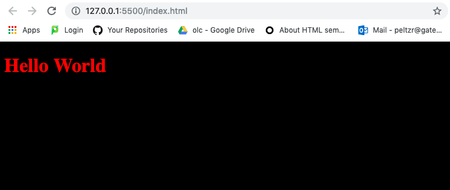

Hello World
====================

This is the Hello World assignment repository for WATS 3010. You will find everything you need to complete the Hello World assignment here.

In order to complete the assignment, you must perform a series of tasks centered around getting used to working with Git and Github. Specifically, we are going to practice forking and cloning repositories, working with branches, and how to use Github Pages.

Before you begin this assignment, you'll need to   
* Sign up for a github.com account
* Configure secure shell on your local machine
* Install and configure Visual Studio Code on your local machine

To complete this assignment, you must complete the following steps:

1. Fork this repo into your personal Github account.
1. Create a "projects" directory on your local machine.
1. Clone your fork of this repo into the "projects" directory.
1. Open the directory created by cloning the repo in Visual Studio Code.
1. Create an index.html file in the root of the project directory.
1. Use the `!<tab>` keystrokes to initialize your html file.
1. Modify the content of the title tag to be "Hello World"
1. Create a `css` directory in the root of your project.
1. Add a `style.css` file to the `css` directory.
1. Add a `link` tag to import the css file into the index.html file. You can place the link tag directory under the `<title>` tag.  It should look like this: `  <link href="css/style.css" rel="stylesheet">`
1. Add an `h1` (header) tag to the body of the index.html file. The content of the `h1` tag should be "Hello World"
1. In the style.css file add text color and background color to your page with an entry like this:
```
body {
  color: red;
  background-color: black;
}
```
13. Make sure all files are saved.  Turn on Auto-Save in VS Code to help with this.
14. Preview your files locally with live-server to make sure they are what you expect.
15. Open the terminal in VS Code.  Mac users will see a "bash" terminal by default.  Windows users should configure git bash to be their default commmand line interface.
16. Stage, Commit and Push your code to github.com with these commands
```
git add .
git commit -m"<description of changes made>"
git push
```
17. Go to github.com and find that our files our now posted on the web.  
18. Go to github.com setting for your repo and configure gh-pages to host your `master` branch.
19. View your hosted file and copy the link into your buffer and note that the domain is "github.io"
20. Go back to the Code tab of github.com and click on the "Edit" button and paste the link into the website input box.
21. Submit both the github.com and the github.io links for your homework.

### Expected Hosted File
  

### Stretch goals 
* Add another HTML page
* Try to add colors based on the `h1` tag
* Add headers content using `h2-h6`

You are encouraged to watch the video demo linked on the assignment resources page for more information about how to complete each of these steps.  You can also consult the FAQ pages for setting up [git/github](https://suwebdev.github.io/wats-lab-faq/first-question.html), [configuring gh-pages](http://127.0.0.1:5500/docs/create-gh-pages-branch-to-host-html-from-github.html) and [Visual Studio Code](https://suwebdev.github.io/wats-lab-faq/second-question.html).

